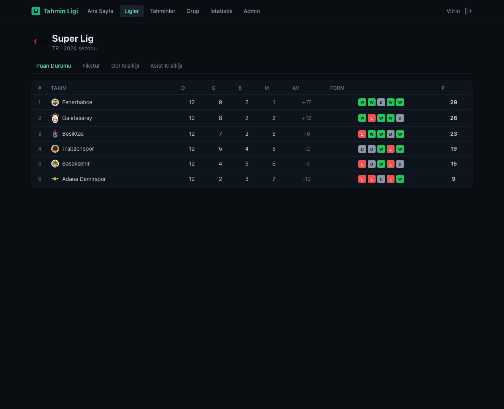
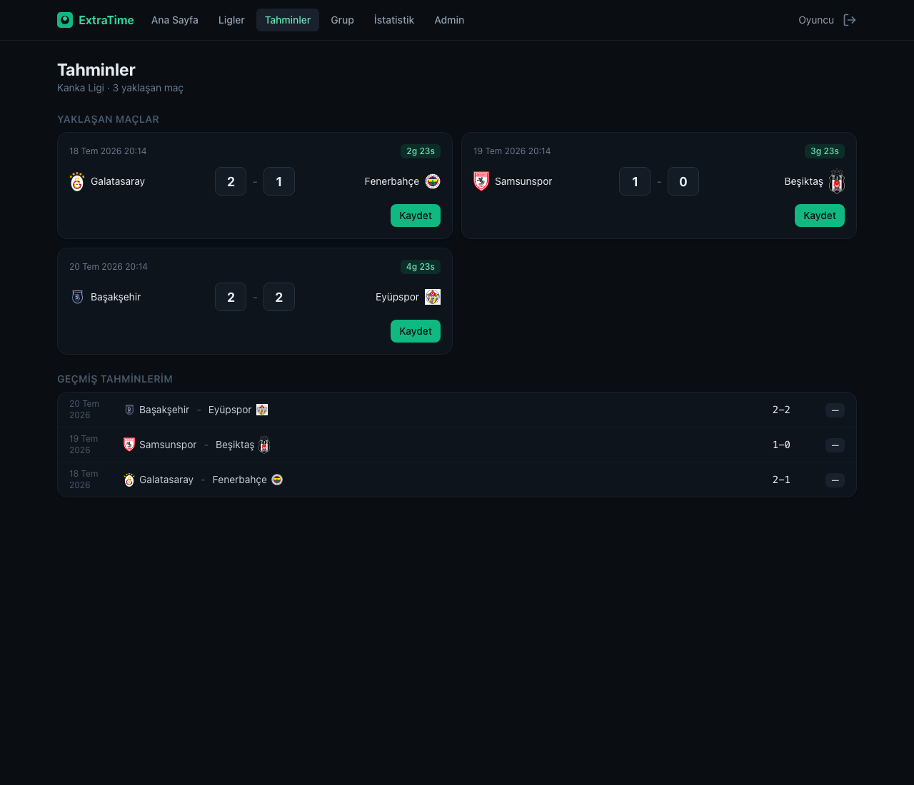
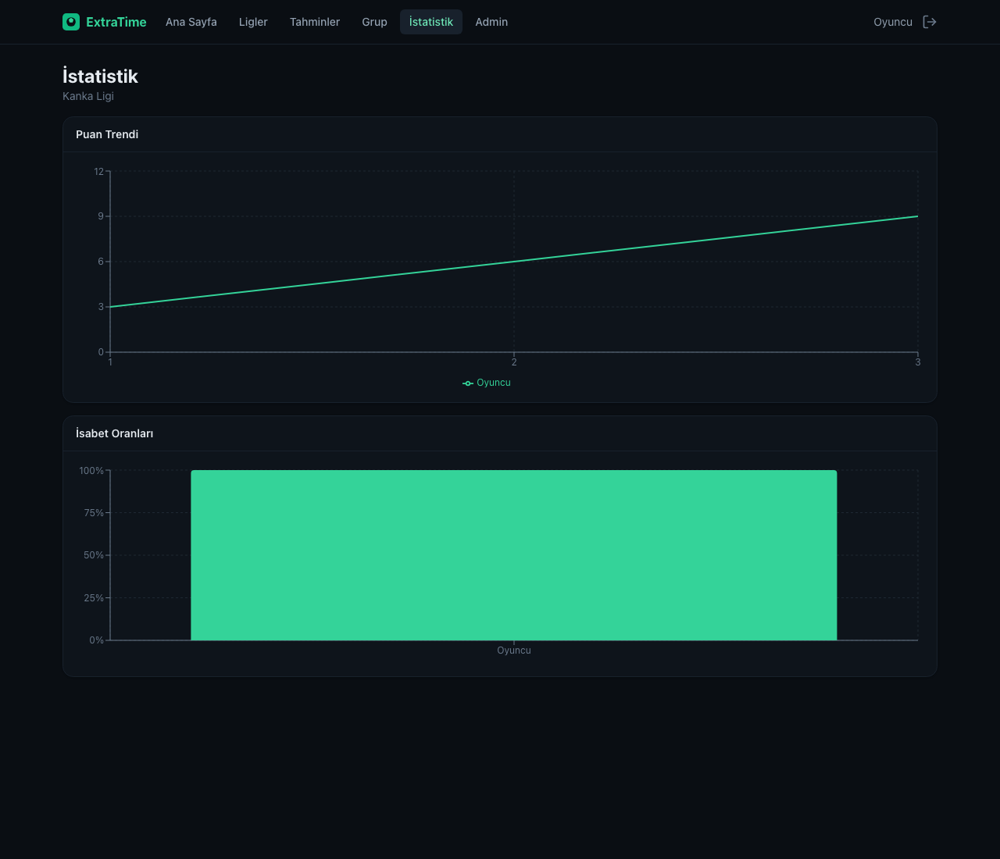

# ExtraTime

A full-stack football prediction & analytics app for a small group of friends. Browse real
league data (standings, fixtures, top scorers), predict upcoming match scores, get scored
automatically when matches finish, and climb the group leaderboard.

The UI is in Turkish; the codebase is in English.

<p align="center">
  
  
</p>
<p align="center">
  
  
</p>

## Features

- **Browse** — standings with W/D/L form, week-by-week fixtures, top scorers & assists across
  6 competitions and multiple seasons, with team crests everywhere.
- **Predict** — enter score predictions for upcoming matches. Predictions lock at kickoff
  (enforced on the server), are scored automatically (exact 3 / correct result 1 / wrong 0),
  and feed a group leaderboard.
- **Analyse** — points trend and accuracy charts (Recharts).
- **Groups** — invite-code based, admin tools, privacy (others' predictions hidden until lock).
- **Cache-first** — the site never calls the football API directly; scheduled syncs fill a
  Postgres cache and everything is served from there, staying well under the free API budget.

## Architecture — "four houses"

Each part lives independently, so no single provider going down can take the project with it.

| Part      | Home                    | If the platform dies…                          |
| --------- | ----------------------- | ---------------------------------------------- |
| Code      | GitHub                  | Nothing — code is portable                     |
| Data      | Neon (PostgreSQL)       | Nothing — independent of the backend host      |
| Backend   | Render (Docker)         | Move the container elsewhere in an evening      |
| Frontend  | Vercel / Netlify        | Static files — host anywhere                    |

### Cache-first data flow

```
WRITE (a few times/day, backend only):
   API-Football ──> sync job ──> UPSERT ──> PostgreSQL (Neon)

READ (every user request):
   React ──> Express API ──> PostgreSQL ──> React

   Rule: a user request NEVER reaches API-Football.
```

The free API plan allows 100 requests/day. Because only the backend's scheduled syncs touch
it (~24-36/day for 6 leagues), 10 users refreshing the page cost zero API requests.

## Tech stack

- **Backend** — Node + TypeScript + Express, PostgreSQL via raw SQL (`pg`, no ORM), Zod,
  bcryptjs, jsonwebtoken, node-cron, pino, Vitest.
- **Frontend** — Vite + React + TypeScript, React Router, TanStack Query, Tailwind CSS v4,
  Recharts, lucide-react.
- **DevOps** — Docker, GitHub Actions (lint · typecheck · test).

## Repository layout

```
backend/   Node + TS + Express API
web/       Vite + React + TS frontend
docs/      screenshots
.github/   CI + scheduled sync workflows
docker-compose.yml
```

## Local development

Prerequisites: Node 22+. A database is optional to boot (`/health` reports `db:false`
without one), but needed for real data.

```bash
# 1. Backend
cd backend
cp .env.example .env          # then fill in the values (see below)
npm install
npm run migrate               # create tables (needs DATABASE_URL)
npm run dev                   # http://localhost:3000

# 2. Frontend (second terminal)
cd web
npm install
npm run dev                   # http://localhost:5173 (proxies /api to :3000)
```

Open http://localhost:5173 and register.

### Environment variables (backend/.env)

| Variable                | Purpose                                                     |
| ----------------------- | ---------------------------------------------------------- |
| `DATABASE_URL`          | Postgres connection string (Neon). Empty = boot without DB |
| `JWT_SECRET`            | Signs auth tokens (≥16 chars; `openssl rand -hex 32`)      |
| `API_FOOTBALL_KEY`      | API-Football key (from dashboard.api-football.com)         |
| `SYNC_SECRET`           | Protects `/admin/sync/*` for external triggers             |
| `ADMIN_EMAILS`          | Comma-separated emails that get the admin panel            |
| `CORS_ORIGIN`           | Allowed origin(s); `*` in dev                              |
| `PORT`, `LOG_LEVEL`     | Server port and log level                                  |

Check which seasons your API-Football plan grants: `npm run check:api`.

## Database & migrations

Raw SQL migrations live in `backend/src/db/migrations/` and are applied in order by a small
runner that records applied files in `schema_migrations` (idempotent).

```bash
npm run migrate     # apply pending migrations
```

## Syncing football data

Syncs run from both an internal cron and HTTP endpoints (the "dual trigger", so a sleeping
free-tier host can be woken from outside). Seed leagues and pull data:

```bash
# with SYNC_SECRET set, or logged in as an ADMIN_EMAILS user in the /admin panel
curl -X POST localhost:3000/api/v1/admin/sync/seed       -H "x-sync-secret: $SYNC_SECRET"
curl -X POST localhost:3000/api/v1/admin/sync/fixtures   -H "x-sync-secret: $SYNC_SECRET"
curl -X POST localhost:3000/api/v1/admin/sync/standings  -H "x-sync-secret: $SYNC_SECRET"
curl -X POST localhost:3000/api/v1/admin/sync/backfill   -H "x-sync-secret: $SYNC_SECRET"  # all seasons, once
```

## API reference

All under `/api/v1`. Auth via `Authorization: Bearer <jwt>`.

| Method | Endpoint                                          | Auth            |
| ------ | ------------------------------------------------- | --------------- |
| GET    | `/health`                                         | none            |
| POST   | `/auth/register`, `/auth/login`                   | none            |
| GET    | `/auth/me`                                         | user            |
| GET    | `/leagues`, `/leagues/:id/standings`              | none            |
| GET    | `/leagues/:id/fixtures?status=upcoming\|finished` | none            |
| GET    | `/leagues/:id/topscorers`, `/topassists`          | none            |
| GET    | `/teams/:id`, `/fixtures/:id`                      | none            |
| POST   | `/groups`, `/groups/join`                          | user            |
| GET    | `/groups`, `/groups/:id`, `/groups/:id/leaderboard`, `/groups/:id/stats` | user |
| PUT    | `/groups/:groupId/predictions/:fixtureId`          | user (server lock) |
| GET    | `/groups/:groupId/predictions`                     | user            |
| GET    | `/groups/:groupId/fixtures/:fixtureId/predictions` | user (privacy)  |
| POST   | `/groups/:id/regenerate-invite`, member admin      | group admin     |
| POST   | `/admin/sync/*`, `GET /admin/sync/status`          | sync secret or platform admin |

Errors are consistent: `{ "error": { "code", "message" } }`.

## Testing

```bash
cd backend && npm test     # unit (scoring, lock, status) + in-memory integration
```

## Docker

```bash
docker compose up --build   # Postgres + API at http://localhost:3000
```

The backend image is multi-stage; the container runs pending migrations then starts the server.

## Deployment

- **Database** — create a Neon project, copy `DATABASE_URL`.
- **Backend** — deploy `backend/` to Render (Docker). Set env vars (`DATABASE_URL`,
  `JWT_SECRET`, `API_FOOTBALL_KEY`, `SYNC_SECRET`, `ADMIN_EMAILS`, `CORS_ORIGIN`,
  `NODE_ENV=production`). Migrations run on container start.
- **Frontend** — deploy `web/` to Vercel/Netlify. Set `VITE_API_URL` to the backend URL
  `.../api/v1`. Set the backend's `CORS_ORIGIN` to the frontend origin.
- **Keeping it synced** — Render's free tier sleeps and its internal cron won't run. Trigger
  syncs from outside: cron-job.org hitting `/api/v1/admin/sync/*` with the `x-sync-secret`
  header, or the included `.github/workflows/sync.yml` scheduled workflow (set the
  `API_BASE_URL` and `SYNC_SECRET` repository secrets).

## Backups

Neon's free-tier restore window is short. Take periodic manual dumps:

```bash
pg_dump "$DATABASE_URL" -Fc -f extratime-$(date +%F).dump
# restore:  pg_restore -d "$DATABASE_URL" extratime-YYYY-MM-DD.dump
```

## Moving to another host

The backend depends on nothing host-specific — only `DATABASE_URL`. To move it:

1. Push the image (or repo) to the new host.
2. Set the same environment variables.
3. Point DNS / the frontend's `VITE_API_URL` at the new backend.

The database (Neon) and frontend are untouched. Estimated time: an evening.
