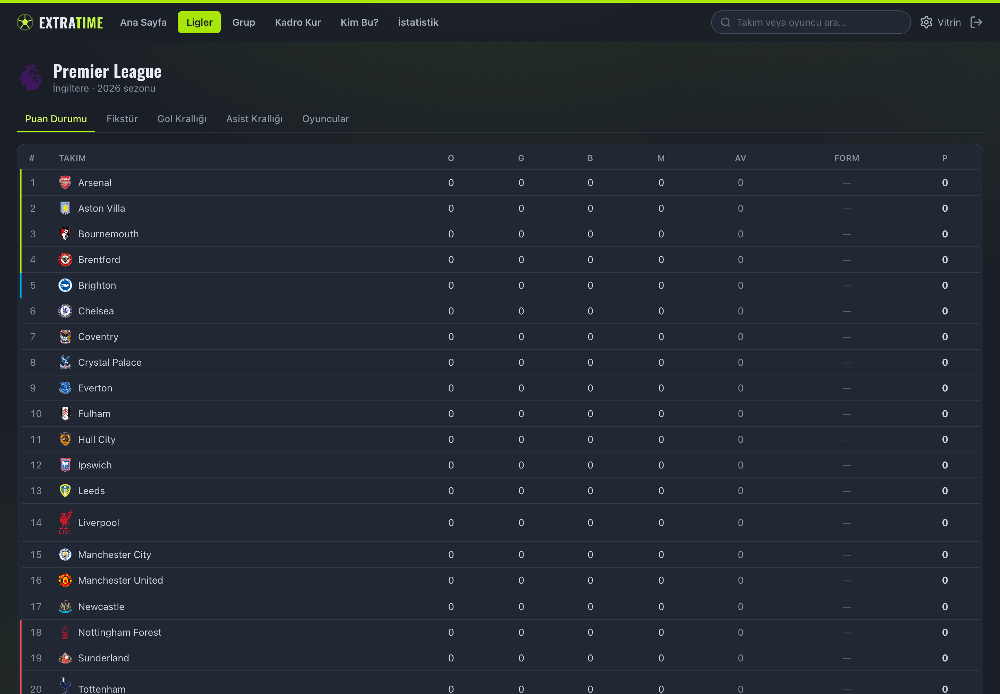
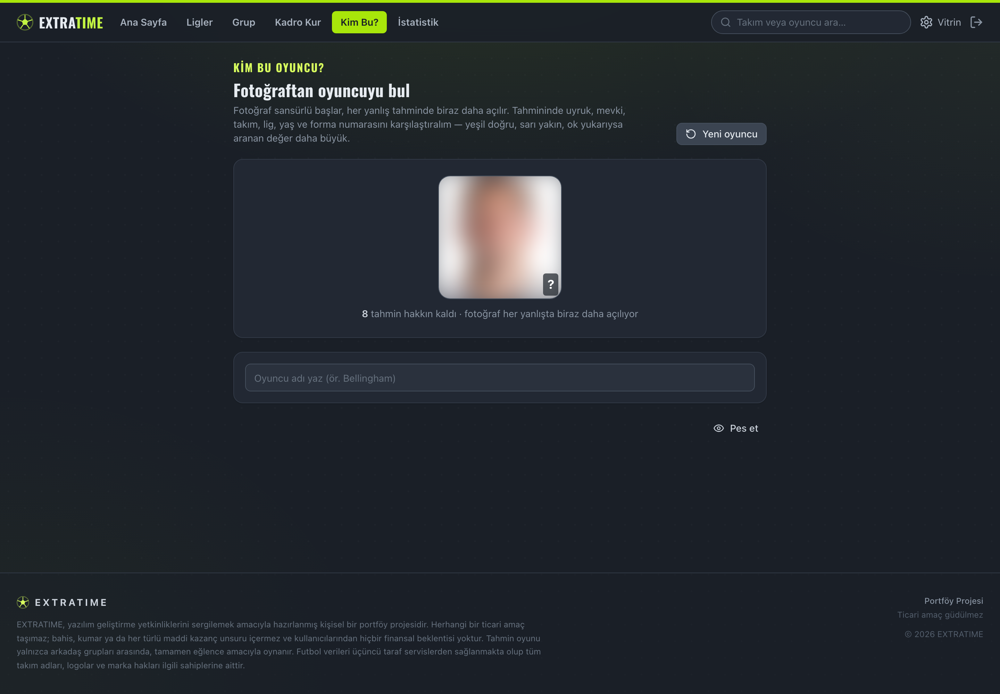
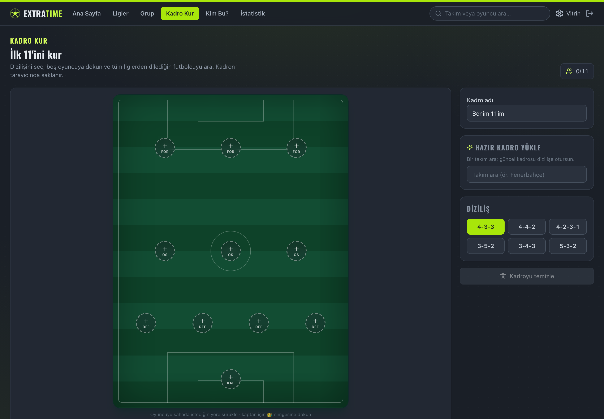
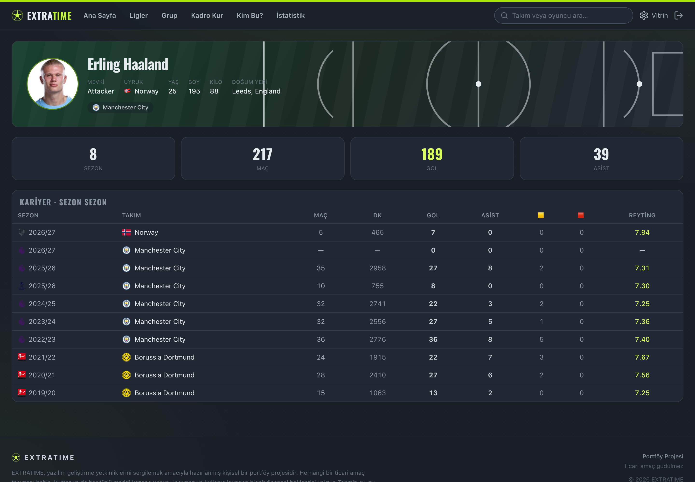
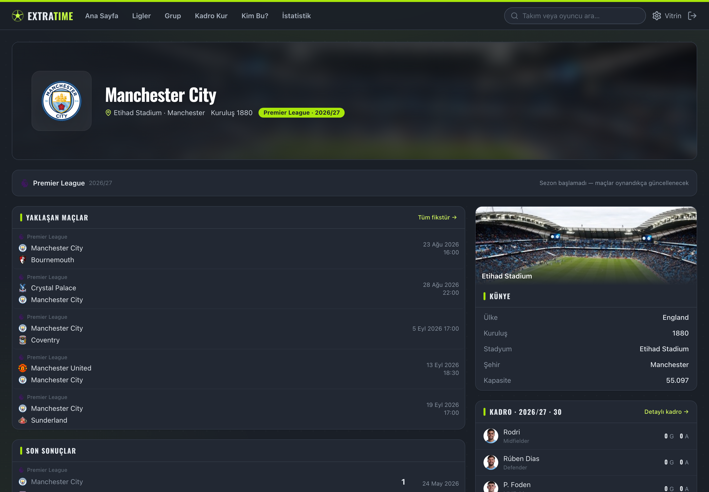
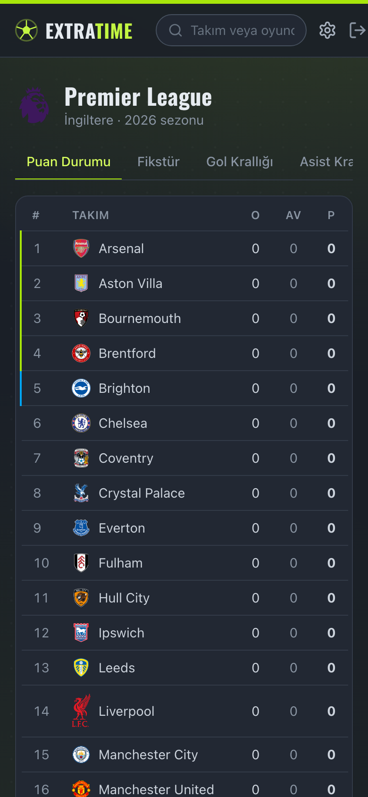

# ExtraTime

A full-stack football companion for a small group of friends: browse real league data,
run a season-long score-prediction game with your friends, play a couple of football
guessing games, and track everyone's form with charts.

The interface is in Turkish; the codebase is in English.

<p align="center">
  &nbsp;
  
</p>
<p align="center">
  &nbsp;
  
</p>
<p align="center">
  &nbsp;
  
</p>

## What it does

- **Browse** real, up-to-date football data — standings, fixtures, live scores, top scorers,
  knockout brackets, and rich team & player pages.
- **Play** a leader-curated prediction game inside your group, plus two standalone football
  games (guess the player, build a starting XI).
- **Analyse** your prediction form with points-trend and accuracy charts.

## Features

### Football data

- **Standings** with W/D/L form, qualification-zone colouring (title / Europe / relegation,
  and the Champions League league-phase cut-offs), and grouped tables for the World Cup.
- **Fixtures** week by week, filterable by team, with live minute and goal feeds during
  matches and a detailed post-match summary (event timeline + team stats).
- **Knockout brackets** for the Champions/Europa/Conference League and the World Cup — a real
  elimination tree with two-legged aggregate ties and penalty deciders.
- **Team pages** — crest, stadium, squad grouped by position, form and schedule.
- **Player pages** — current club, age, career totals and a season-by-season history; players
  who have left or retired are marked as such.
- **Global search** across every team and player — accent-insensitive (finds "Ødegaard" from
  "odegaard"), full names, and the best-known match first.

Coverage spans Europe's big five leagues, Portugal, the Netherlands, Brazil, Saudi Arabia,
the USA (MLS) and Turkey — their second divisions too — the Champions / Europa / Conference
League and the World Cup.

### The prediction game

- A group leader **curates** the matches that count; members predict only those.
- The primary pick is the **match outcome (1X2)**; adding an exact score is optional and a
  gamble. **Scoring:** exact score **5**, correct winner **3** (**2** if you risked a wrong
  score), correct draw **1** (**0** if you risked a wrong score), wrong **0**.
- Predictions **lock at kickoff** — always checked on the server against database time, never
  the browser clock — are **settled automatically** when a match finishes, and feed a group
  leaderboard.
- A group can run **several games at once**; each has its own matches, **2× joker**, live
  leaderboard, **weekly champions**, and an overall champion when it's finished.

### Extra games

- **Kim Bu?** — guess the player from a censored photo that opens with each wrong guess. Every
  guess is scored on nationality (with flag), position, team, league, age and shirt number.
- **Kadro Kur** — a visual line-up builder: pick a formation, drop in any player, or load a
  team's current squad as a starting XI.

### Under the hood

- **Cache-first** — a user request never reaches the football API; scheduled syncs fill a
  Postgres cache and everything is served from there.
- **Current squads, daily** — rosters are refreshed every day from live squad data, so
  transfers show up during the window.

## Architecture — "four houses"

Each part lives independently, so no single provider going down can take the project with it.

| Part     | Home              | If the platform dies…                     |
| -------- | ----------------- | ----------------------------------------- |
| Code     | GitHub            | Nothing — code is portable                |
| Data     | Neon (PostgreSQL) | Nothing — independent of the backend host |
| Backend  | Render (Docker)   | Move the container elsewhere in an evening |
| Frontend | Vercel / Netlify  | Static files — host anywhere              |

### Cache-first data flow

```
WRITE (scheduled, backend only):
   API-Football ──> sync job ──> UPSERT ──> PostgreSQL (Neon)

READ (every user request):
   React ──> Express API ──> PostgreSQL ──> React

   Rule: a user request NEVER reaches API-Football.
```

Because only the backend's scheduled syncs touch the football API, the cost stays flat no
matter how many friends refresh the page — ten users browsing cost zero API requests. Every
sync records its request count so the daily budget is easy to keep an eye on.

## Tech stack

- **Backend** — Node + TypeScript + Express, PostgreSQL via raw parameterised SQL (`pg`, no
  ORM), Zod for input validation, bcryptjs, jsonwebtoken, node-cron, pino, Vitest.
- **Frontend** — Vite + React + TypeScript, React Router, TanStack Query, Tailwind CSS v4,
  Recharts, lucide-react.
- **DevOps** — Docker, GitHub Actions (lint · typecheck · test).

## Repository layout

```
backend/   Node + TS + Express API
web/       Vite + React + TS frontend
docs/      screenshots
.github/   CI + scheduled sync workflows
docker-compose.yml
```

## Local development

Prerequisites: Node 22+. A database is optional to boot (`/health` reports `db:false` without
one), but needed for real data.

```bash
# 1. Backend
cd backend
cp .env.example .env          # then fill in the values (see below)
npm install
npm run migrate               # create tables (needs DATABASE_URL)
npm run dev                   # http://localhost:3000

# 2. Frontend (second terminal)
cd web
npm install
npm run dev                   # http://localhost:5173 (proxies /api to :3000)
```

Open http://localhost:5173 and register.

### Environment variables (backend/.env)

| Variable                | Purpose                                                        |
| ----------------------- | ------------------------------------------------------------- |
| `DATABASE_URL`          | Postgres connection string (Neon). Empty = boot without a DB  |
| `JWT_SECRET`            | Signs auth tokens (≥16 chars; `openssl rand -hex 32`)         |
| `API_FOOTBALL_KEY`      | API-Football key (from dashboard.api-football.com)            |
| `API_FOOTBALL_RPM`      | Client rate limit; keeps syncs under the plan's per-minute cap |
| `SYNC_SECRET`           | Protects `/admin/sync/*` for external triggers                |
| `ADMIN_EMAILS`          | Comma-separated emails that get the admin panel               |
| `CORS_ORIGIN`           | Allowed origin(s); `*` in dev                                 |
| `PORT`, `LOG_LEVEL`     | Server port and log level                                     |

Check which seasons your API-Football plan grants: `npm run check:api`.

## Database & migrations

Raw SQL migrations live in `backend/src/db/migrations/` and are applied in order by a small
runner that records applied files in `schema_migrations` (idempotent, safe to re-run).

```bash
npm run migrate     # apply pending migrations
```

## Syncing football data

Every sync runs from both an internal cron and an HTTP endpoint (the "dual trigger", so a
sleeping free-tier host can be woken from outside). Seed the leagues, then pull data:

```bash
# with SYNC_SECRET set, or logged in as an ADMIN_EMAILS user in the /admin panel
curl -X POST localhost:3000/api/v1/admin/sync/seed       -H "x-sync-secret: $SYNC_SECRET"
curl -X POST localhost:3000/api/v1/admin/sync/fixtures   -H "x-sync-secret: $SYNC_SECRET"
curl -X POST localhost:3000/api/v1/admin/sync/standings  -H "x-sync-secret: $SYNC_SECRET"
curl -X POST localhost:3000/api/v1/admin/sync/squads     -H "x-sync-secret: $SYNC_SECRET"  # current rosters
curl -X POST localhost:3000/api/v1/admin/sync/backfill   -H "x-sync-secret: $SYNC_SECRET"  # all seasons, once
```

The scheduler runs fixtures twice a day, standings/scorers/assists and a squad refresh once a
day, results-and-settle hourly through the evening, and live scores every couple of minutes
(a no-op that costs nothing off match days).

## API reference

All under `/api/v1`. Auth via `Authorization: Bearer <jwt>`.

| Method | Endpoint                                                        | Auth                |
| ------ | -------------------------------------------------------------- | ------------------- |
| GET    | `/health`                                                     | none                |
| POST   | `/auth/register`, `/auth/login`                               | none                |
| GET    | `/auth/me`                                                     | user                |
| GET    | `/leagues`, `/leagues/:id/standings`, `/leagues/:id/bracket`  | none                |
| GET    | `/leagues/:id/fixtures?status=upcoming\|finished`             | none                |
| GET    | `/leagues/:id/topscorers`, `/leagues/:id/topassists`          | none                |
| GET    | `/fixtures/live`, `/fixtures/upcoming`, `/fixtures/:id`        | none                |
| GET    | `/teams/:id`, `/teams/:id/squad`, `/players/:apiId`           | none                |
| GET    | `/search?q=`, `/players/guess/pool`, `/players/guess/search`  | none                |
| POST   | `/groups`, `/groups/join`                                     | user                |
| GET    | `/groups/:id/games`, `/groups/:id/games/:gameId`             | user                |
| PUT    | `/groups/:groupId/predictions/:fixtureId`                    | user (server lock)  |
| GET    | `/groups/:id/leaderboard`, `/groups/:id/stats`               | user                |
| POST   | `/admin/sync/*`, `GET /admin/sync/status`                    | sync secret / admin |

Errors are consistent: `{ "error": { "code", "message" } }`.

## Testing

```bash
cd backend && npm test     # unit (scoring, lock, status, bracket) + in-memory integration
```

## Docker

```bash
docker compose up --build   # Postgres + API at http://localhost:3000
```

The backend image is multi-stage; the container runs pending migrations then starts the server.

## Deployment

- **Database** — create a Neon project, copy `DATABASE_URL`.
- **Backend** — deploy `backend/` to Render (Docker). Set the env vars (`DATABASE_URL`,
  `JWT_SECRET`, `API_FOOTBALL_KEY`, `API_FOOTBALL_RPM`, `SYNC_SECRET`, `ADMIN_EMAILS`,
  `CORS_ORIGIN`, `NODE_ENV=production`). Migrations run on container start.
- **Frontend** — deploy `web/` to Vercel/Netlify. Set `VITE_API_URL` to the backend URL
  `.../api/v1`, and set the backend's `CORS_ORIGIN` to the frontend origin.
- **Keeping it synced** — Render's free tier sleeps and its internal cron won't run. Trigger
  syncs from outside: cron-job.org hitting `/api/v1/admin/sync/*` with the `x-sync-secret`
  header, or the included `.github/workflows/sync.yml` scheduled workflow (set the
  `API_BASE_URL` and `SYNC_SECRET` repository secrets).

## Backups

Neon's free-tier restore window is short, so take periodic manual dumps:

```bash
pg_dump "$DATABASE_URL" -Fc -f extratime-$(date +%F).dump
# restore:  pg_restore -d "$DATABASE_URL" extratime-YYYY-MM-DD.dump
```

## Moving to another host

The backend depends on nothing host-specific — only `DATABASE_URL`. To move it: push the image
(or repo) to the new host, set the same environment variables, and point the frontend's
`VITE_API_URL` at the new backend. The database (Neon) and frontend are untouched. Estimated
time: an evening.

---

Built as a real, deployable product for a group of friends — and as a portfolio piece.
Football data is provided by third parties; all club names and logos belong to their owners.
Not affiliated with any club or league, and not for commercial use.
